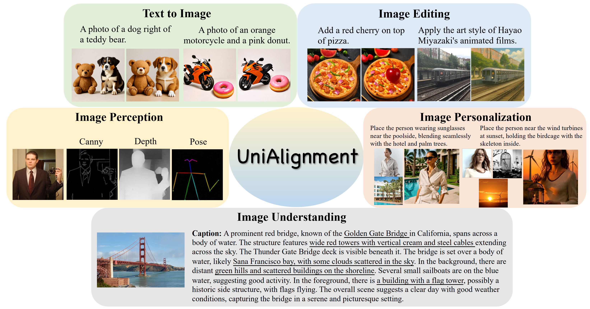
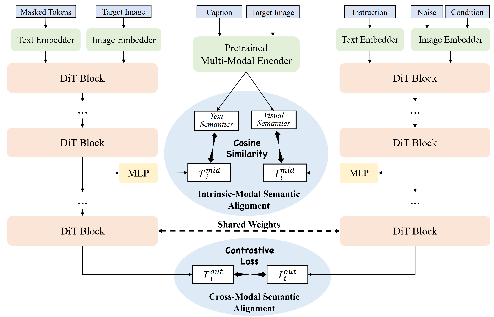

# UniAlignment: Semantic Alignment for Unified Image Generation, Understanding, Manipulation and Perception

<h5 align="center"> 

[](https://arxiv.org/abs/2509.23760)
[](https://github.com/glimmer16/UniAlignment)
[](https://huggingface.co/glimmer16/UniAlignment)
[](/LICENSE)
<!--[](https://huggingface.co/TencentARC/TokLIP)-->


</div>

**This repository is the official PyTorch implementation of the paper "UniAlignment: Semantic Alignment for Unified Image Generation, Understanding, Manipulation and Perception".**

</div>



### Abstract
> The remarkable success of diffusion models in text-to-image generation has sparked growing interest in expanding their capabilities to a variety of multi-modal tasks, including image understanding, manipulation, and perception. These tasks require advanced semantic comprehension across both visual and textual modalities, especially in scenarios involving complex semantic instructions. However, existing approaches often rely heavily on vision-language models (VLMs) or modular designs for semantic guidance, leading to fragmented architectures and computational inefficiency. To address these challenges, we propose UniAlignment, a unified multimodal generation framework within a single diffusion transformer. UniAlignment introduces a dual-stream diffusion training strategy that incorporates both intrinsicmodal semantic alignment and cross-modal semantic alignment, thereby enhancing the model’s cross-modal consistency and instruction-following robustness. Additionally, we present SemGen-Bench, a new benchmark specifically designed to evaluate multimodal semantic consistency under complex textual instructions. Extensive experiments across multiple tasks and benchmarks demonstrate that UniAlignment outperforms existing baselines, underscoring the significant potential of diffusion models in unified multimodal generation.

## 👀 Introduction

<div align="center">

</div>

- We introduce UniAlignment, a unified multimodal generative model based on **a single Diffusion Transformer**, demonstrating outstanding performance while maintaining lightweight design and computational efficiency.

- UniAlignment introduces **two complementary semantic alignment mechanisms** that significantly enhances image-text semantic consistency and instruction-following robustness.

- A rigorous new benchmark **SemGen-Bench** is constructed for evaluating multimodal semantic alignment under complex, compositional instructions, establishing a highstandard baseline for future research.

## 🔜 TODOs
- [x] Technical report.
- [x] Release training codes and pretrained weights.
- [x] Release inference codes.
- [x] Release SemGen-Bench.

## 🔧 Installation

```shell
git clone https://github.com/glimmer16/UniAlignment.git
cd UniAlignment
conda create -n unialignment python=3.10
conda activate unialignment
pip install --upgrade pip 
pip install -r requirements.txt
```

## ⚙️ Usage

### Model Weight

The pre-trained checkpoints can be downloaded through the following link: https://huggingface.co/glimmer16/UniAlignment

### Data

The dataset should be organized into a JSONL file in the following format (using ShareGPT-4o as an example):

T2I Data:

```python
{
  "dataset": "ShareGPT4o-Image",
  "image": ["image/8483.png"],
  "conversations": [
                      {"from": "human", "value": "In a compelling medium close-up shot..."},
                      {"from": "gpt", "value": "<image>"}
                    ],
  "img_w": [1024], "img_h": [1024]
}
```

TI2I Data:

```python
{
  "dataset": "ShareGPT4o-Image",
  "image": ["image/v2v_9693.png", "image/v2v_9692.png"],
  "conversations": [
                      {"from": "human", "value": "A stunning view of the Sydney Opera House at sunset..."},
                      {"from": "gpt", "value": ""}
                    ],
  "img_w": [1024, 1024], "img_h": [1024, 1024],
  "instruction": "Change the image by replacing the tiny house on wheels with a boat floating close to the Sydney Opera House."
}
```


### Training

Download the SD3-medium checkpoint for training: [SD3](https://huggingface.co/stabilityai/stable-diffusion-3-medium-diffusers).

Train UniAlignment using the scripts `train_unialignment.sh`. You can change the config in `configs/config_unnify.py`.

```shell
bash train_unialignment.sh
```

### Inference

We provide the inference example in `inference.py`. 

```shell
python inference.py
```


## 🙏 Acknowledgement
This repo is mainly based on [DualDiffusion](https://github.com/zijieli-Jlee/Dual-Diffusion) and [SD3](https://stability.ai/news/stable-diffusion-3-medium).

Thanks to the original authors for their excellent work!


## 📝 Citation
Please cite our work if you use our code or discuss our findings in your own research:
```bibtex
@article{song2025unialignment,
  title={UniAlignment: Semantic Alignment for Unified Image Generation, Understanding, Manipulation and Perception},
  author={Song, Xinyang and Wang, Libin and Wang, Weining and Liu, Shaozhen and Zheng, Dandan and Chen, Jingdong and Li, Qi and Sun, Zhenan},
  journal={arXiv preprint arXiv:2509.23760},
  year={2025}
}
```


## 📂 Contact
If you have further questions, please open an issue or contact <xinyang.song@cripac.ia.ac.cn>.

Discussions and potential collaborations are also welcome.
